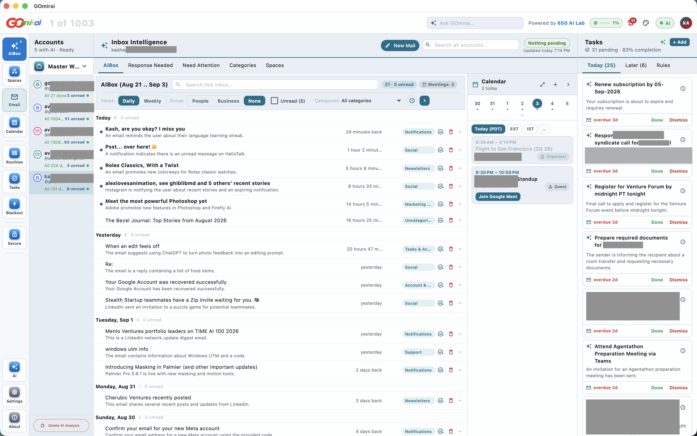
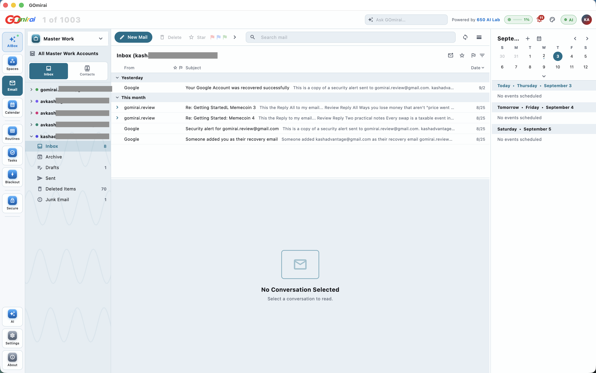
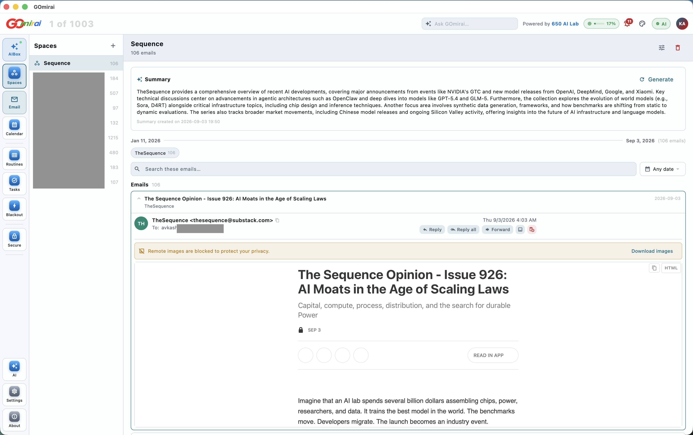
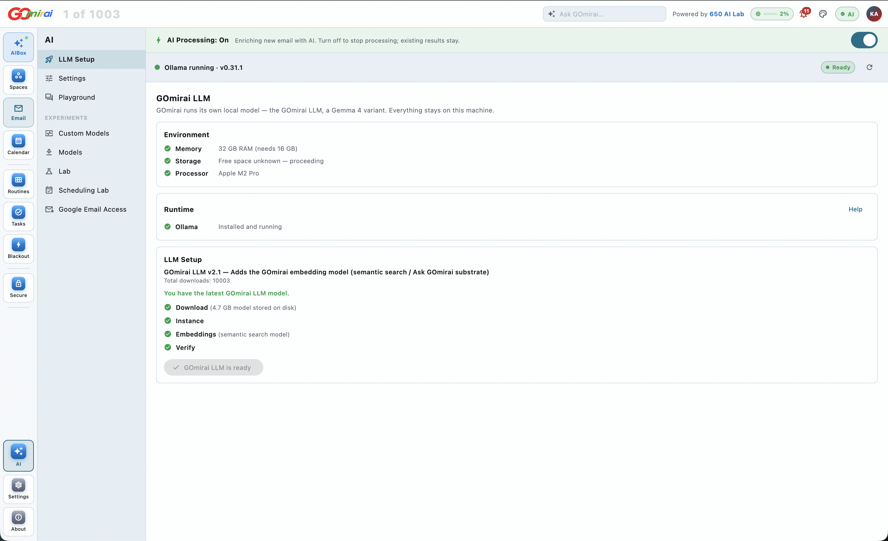

# GOmirai — public documentation

**GOmirai is a full Outlook-style email client with a private AI brain that runs
on your own machine.** It connects your Gmail accounts and calendars, and adds an
intelligence layer that reads across *all* of them — so instead of processing a
thousand messages one at a time, you see what actually matters today.

The AI runs locally. Your email content is analysed on your own computer by a
model GOmirai downloads to your disk. It is never sent to OpenAI, Anthropic,
Google Gemini, or any other cloud AI service.

Built by **650 AI Lab**.

| | |
|---|---|
| **Platforms** | macOS (Apple Silicon + Intel) · Windows 10 / 11 (64-bit) |
| **Current version** | 0.1.0051 |
| **Download** | <https://650ailab.com/gomirai> |
| **Price** | FREE |

---

## What it looks like

### Email — the side you already know

Underneath the AI is a complete Outlook-style client: three panes, folder trees
per account, workspaces that group accounts, search, and a My Day calendar rail.
Turn the AI off entirely and this still works. See [features.md](features.md).

### Spaces — everything on one topic, summarised

A Space gathers related mail — a sender, a project, a thread of work — and the
local model summarises **the whole collection**, not just the newest message. The
banner in the reading pane is remote images blocked by default, so senders cannot
track you by your opening a message. See [features.md](features.md).

### The local model — set up in one flow

**AI → LLM Setup** checks your machine, downloads the model, registers it and
verifies it answers — each step with its own light. Until all of them are green
the app says Not Ready and keeps AI features switched off rather than half-working.
Everything here runs on your own hardware. See [gomirai-llm.md](gomirai-llm.md).

---

## Documents in this folder

| File | What it covers |
|---|---|
| [overview.md](overview.md) | What GOmirai is, the problem it solves, and the two ways to work in it |
| [features.md](features.md) | Everything the application does, area by area |
| [gomirai-llm.md](gomirai-llm.md) | The local AI model — what it is, its size, what it can do, and how it works inside the app |
| [privacy-and-data.md](privacy-and-data.md) | What data GOmirai touches, where it is stored, and the Google permissions it asks for |
| [install.md](install.md) | System requirements, download, install and first run |
| [plans.md](plans.md) | Plan tiers and what each includes |
| [faq.md](faq.md) | Common questions |

---

## Security and verification status

GOmirai reads and writes your mail, so Google classifies one of the permissions
it uses — `gmail.modify` — as a **Restricted scope**. Apps using a restricted
scope face a stricter review than ordinary ones, and must be independently
security-assessed every year. We think you should be able to see where we stand
in that process rather than have to ask.

**Scope review — no outstanding items.** We originally requested Google's
full-access mail scope. Google recommended something narrower, and we agreed:
`https://mail.google.com/` was removed from the project, and with it the ability
to permanently delete mail. GOmirai now asks for exactly four permissions —
`gmail.modify`, `calendar.events`, `openid` and `email`. Google's most recent
review of that scope set and of a full demonstration of the application raised
no further scope or functionality items.

**ADA-CASA AL1 security assessment — in progress.** This is the remaining
requirement for verification, and the reason it is not yet complete. CASA (Cloud
Application Security Assessment) is run by an assessor authorised by the
[App Defense Alliance](https://appdefensealliance.dev/casa) and checks the
service that handles Google user data against the OWASP ASVS Level 1 standard.
Ours is scheduled for completion by **2 December 2026**, and must be repeated
annually thereafter.

What is already done and independently checkable: HTTPS everywhere with HSTS, a
restrictive Content-Security-Policy, a full set of HTTP security headers, no
exposed API documentation, encrypted-at-rest Google refresh tokens, and a
dependency tree with no known vulnerabilities.

It is worth being clear about what this assessment covers, because it is
sometimes assumed to cover more: it examines the **650 AI Lab service**, which
handles sign-in and brokers your Google connection. It does not examine the AI,
because the AI never reaches a server — the model runs on your own machine and
your email content is never transmitted to us. See
[privacy-and-data.md](privacy-and-data.md).

---

## In one line

A familiar inbox you already know how to use, plus a second way to work — an AI
layer that understands your mail as a whole — with none of your mail leaving
your machine to get there.
